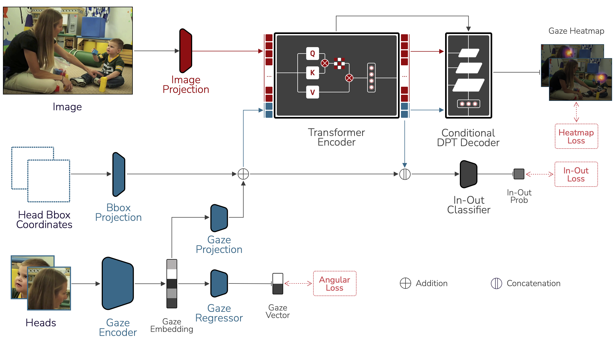

# Sharingan: A Transformer Architecture for Multi-Person Gaze Following

<div style="display: flex; justify-content: space-between;">
  
  
</div>

## Overview

**Authors:** Samy Tafasca, Anshul Gupta, Jean-marc Odobez 

[`Paper`](https://openaccess.thecvf.com/content/CVPR2024/papers/Tafasca_Sharingan_A_Transformer_Architecture_for_Multi-Person_Gaze_Following_CVPR_2024_paper.pdf) | [`Video`](https://www.youtube.com/watch?v=-z92XQmZaqA) | [`BibTeX`](#citation)



This is the official Github repository for the paper "Sharingan: A Transformer Architecture for Multi-Person Gaze Following" published at CVPR 2024. Here, you will find the code, data artifacts, and model checkpoints.

## Setup
### 1. Create the Conda environment
First, we need to clone the repository 
```shell
git clone https://github.com/idiap/sharingan.git
cd sharingan
```

Next, create the conda environment and activate it after installing the necessary packages
```shell
conda env create -f environment.yaml
conda activate sharingan
```

### 2. Organize the data artifacts
Sharingan requires more than 1 person's head bounding box for training multi-person models. GazeFollow however, mostly annotates a single person per image. As explained in the paper, we ran an off-the-shelf head detector to find other head boxes when available.

For the sake of convenience and reproducibility, we provide our head bounding boxes. Download them from [here](https://zenodo.org/records/14066123/files/sharingan_data.tar.gz?download=1), and unzip them under the folder `data`. 

You will also find new annotation files for GazeFollow under `data`. We noticed that the quality of the head box annotations is often poor, so we used the head detections (which we found very accurate) to replace the original annotations. This only applies to the training and validation splits, the test set annotations remain unchanged to ensure a fair comparison with previous methods from the literature.

In order to train models on GazeFollow, you will also need pretrained weights for the gaze encoder (ie. a ResNet18 we pre-trained on Gaze360) and ViT encoder (ie. [MultiMAE](https://github.com/EPFL-VILAB/MultiMAE) pretrained on Imagenet). For demo purposes, you will also need the checkpoint of the YOLO head detector. You can download all of them [here](https://zenodo.org/records/14066123/files/sharingan_weights.tar.gz?download=1) and put them in the folder `weights`.

The main benchmarks (ie. [GazeFollow](https://www.dropbox.com/s/3ejt9pm57ht2ed4/gazefollow_extended.zip?dl=0), [VideoAttentionTarget](https://www.dropbox.com/s/8ep3y1hd74wdjy5/videoattentiontarget.zip?dl=0), and [ChildPlay](https://zenodo.org/records/8252535)) can be downloaded from their respective sources.

### 3. Configure the paths in the configuration files
Finally, update the data paths in the yaml configuration files that can be found in `src/conf`. For each dataset, we have: 
- `root`: path to the original dataset, which includes both images and annotations (as can be downloaded from its original source)
- `root_heads`: path to the folder where you unzipped the head detections from the previous step.
- `root_annotations`: path to the new annotation files of GazeFollow. This should be the path to the folder `data` if you haven't moved them.

Furthermore, you need to update the root paths to the pre-trained weights: `model.pretraining.gaze360`, `model.pretraining.multivit` and `model.weights`

If you're using W&B to track experiments, please specify your username in the file `tracking.py`.

## Training and Testing
This project uses PyTorch Lightning to structure the code for experimentation. The `main.py` python file is the entry point, but we use the `submit-experiment.sh` to properly setup the experiment by creating a folder (ie. `date/time`) under `experiments` to store the results. This will also take a snapshot of the code used to run the experiment.

Moreover, we use the Hydra package to organize configuration files. We provide separate configuration files for GazeFollow (`src/conf/config_gf.yaml`), VideoAttentionTarget (`src/conf/config_vat.yaml`), and ChildPlay (`src/conf/config_cp.yaml`) to reproduce the results from the paper. 

Here is how you can run a training job on GazeFollow
```shell
python main.py --config-name "config_gf"
```
Running the above command should start training on GazeFollow. At the end, you should get results that are similar to the paper. However, the preferred way is to copy paste that line inside the `submit-experiment.sh` and run the following command
```shell
sh submit-experiment.sh
```

You can also override parts of the default configuration file (`src/conf/config.yaml`) via command line arguments. This can be used for example to test a model on a dataset. The code below will evaluate the GazeFollow model checkpoint on GazeFollow's test set.

```shell
python main.py experiment.task=test experiment.dataset=gazefollow test.checkpoint=checkpoints/gazefollow.pt
```
Running the above command should output the results reported in the paper for the GazeFollow dataset.

Training on GazeFollow should take about 8-10 hours on an RTX 3090 graphics card, assuming you use the provided configuration (ie. training for 20 epochs). Fine-tuning on VideoAttentionTarget or ChildPlay will typically take between 2 to 3 hours.

## Model Checkpoints
We provide model [checkpoints](https://zenodo.org/records/14066123/files/sharingan_checkpoints.tar.gz?download=1) for GazeFollow, VideoAttentionTarget, and ChildPlay. Place them under `checkpoints` after you download them.

## Demo
For convenience, we also provide a demo jupyter notebook `notebooks/demo.ipynb` to test the models on images. Furthermore, we also provide a `demo.py` python script to test the model on a given video. Both the notebook and python file use the head detection model mentioned previously in order to detect people's heads. For video prediction, we also use an off-the-shelf tracker to ensure consistency. These demo scripts can be adapted to your own needs.

Below is a minimal example of how to run the `demo.py` script. Check the script to learn about other available options. By default, the script uses a VideoAttentionTarget checkpoint.
```shell
python demo.py --input-dir "/path/to/input/folder" --input-filename "video-file.mp4" --output-dir "./samples"
```

## Citation
If you use our code, models or data assets, please consider citing us:
```bibtex
@inproceedings{tafasca2024sharingan,
  title={Sharingan: A Transformer Architecture for Multi-Person Gaze Following},
  author={Tafasca, Samy and Gupta, Anshul and Odobez, Jean-Marc},
  booktitle={Proceedings of the IEEE/CVF Conference on Computer Vision and Pattern Recognition},
  pages={2008--2017},
  year={2024}
}
```

## Acknowledgement
Parts of the code of the model architecture (including model checkpoint) were adapted from the repository [MultiMAE](https://github.com/EPFL-VILAB/MultiMAE). We are thankful to the authors for their contribution.